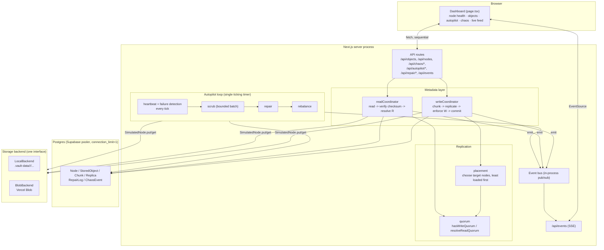
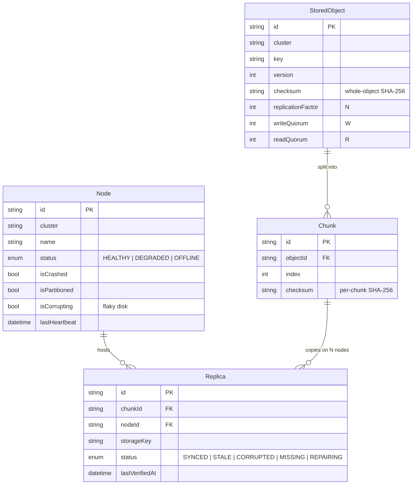
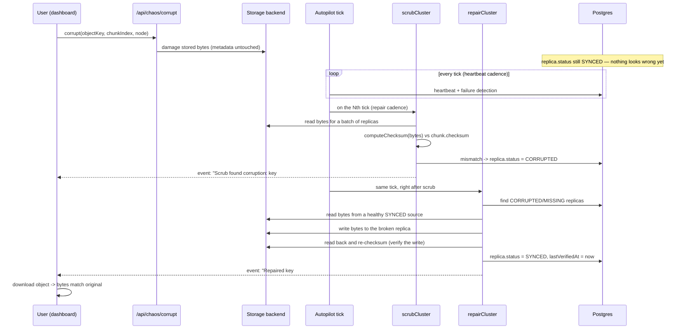
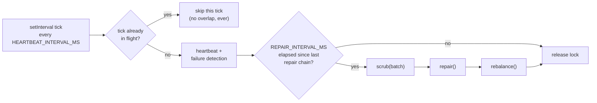

# Architecture diagrams

These are [Mermaid](https://mermaid.js.org) diagrams — they render natively on GitHub, GitLab, and
most editor Markdown previews (VS Code needs no extra setup for GitHub-flavored preview; other tools
can paste the block into https://mermaid.live).

## 1. Components

## 2. Data model

## 3. Corruption → repair sequence (the demo pipeline)

## 4. Autopilot tick, internally

Why this is one timer instead of three (heartbeat / repair / scrub each on their own `setInterval`) is
explained in [DESIGN.md](DESIGN.md#autopilot-loop); the short version is in the diagram below.

